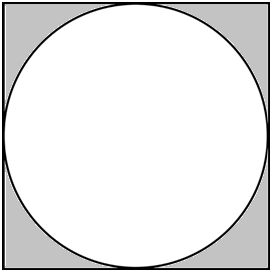

# | Go | Practice 01 

[Link to Presentation](https://docs.google.com/presentation/d/1MTw8YVS6KrK4U09sw-MrkHEY6gRjjd31x1L8coTUWzg/edit?usp=sharing)

## Topics:
- Installing and setting up go workspace
- Go workspace directory structure
- Hello World
- Variables
- fmt.Println() & fmt.Sprintf()
- Variables & Basic types
- Zero values & Type inference
- Constants
- Arithmetic Operators & Logical Expression
- Type conversions

## Tasks:

### Task1: Swap 2 numbers

In this task, user is asked to enter two numbers and program will swap two numbers without using third variable

```go
package main

import "fmt"

func main() {
	var a, b int = 3, 4

	// fmt.Scanf("%d", &a)
	// fmt.Scanf("%d", &b)
	fmt.Printf("a = %d, b = %d\n", a, b)
	//
	// WRITE YOUR CODE HERE
	//
	fmt.Printf("a = %d, b = %d\n", a, b)
}
```

Example: 
```
a = 3, b = 4
a = 4, b = 3
```

### Task2: isOdd and isEven

Write go functions to check whether a number is even and is odd

```go
package main

import "fmt"

func main() {
	var a, b int = 3, 4

	// fmt.Scanf("%d", &a)
	// fmt.Scanf("%d", &b)
	fmt.Printf("a = %d, b = %d\n", a, b)

	// fmt.Println(a, "is odd: ", isOdd(a))
	// fmt.Println(b, "is even: ", isEven(b))
}

// func isEven(num int) bool {
// 	//
// 	// WRITE YOUR CODE HERE
// 	//
// }

// func isOdd(num int) bool {
// 	//
// 	// WRITE YOUR CODE HERE
// 	//
// }
```

Example: 
```
a = 3, b = 4
3 is odd:  true
4 is even:  true
```

### Task3: Area of circle inscribed in a square
Find the shaded region by given R(radius of the circle)



```go
package main

import (
	"fmt"
)

func main() {
	var r float32 = 10.04

	// fmt.Scanf("%f", &r)
	fmt.Println("R =", r)

	fmt.Printf("Area: %0.2f\n", area(r))
}

func area(r float32) (area float32) {
	//
	// WRITE YOUR CODE HERE
	//
	return area
}
```

Example: 
```
R = 10.04
Area: 86.53
```

## Reference
- https://golang.org/doc/install
- https://www.geeksforgeeks.org/go-operators/
- https://www.geeksforgeeks.org/type-casting-or-type-conversion-in-golang/
- https://tour.golang.org/
- https://gobyexample.com/
## FAQ

#### Question 1

Answer 1

#### Question 2

Answer 2

  
## Feedback
If you have any feedback, please reach out to me at saidamir.botirov@gmail.com
## Authors
[@Saidamir_Botirov](https://www.linkedin.com/in/saidamir-botirov)
